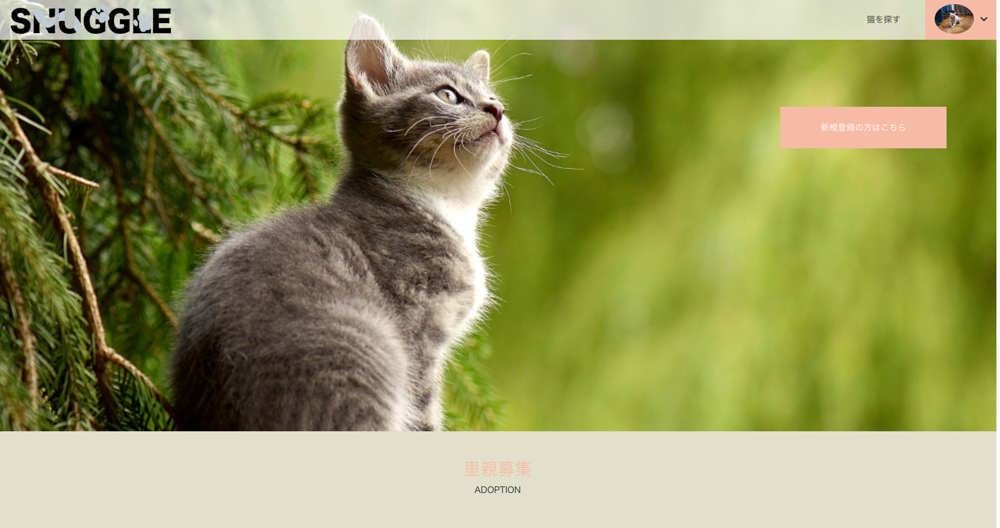
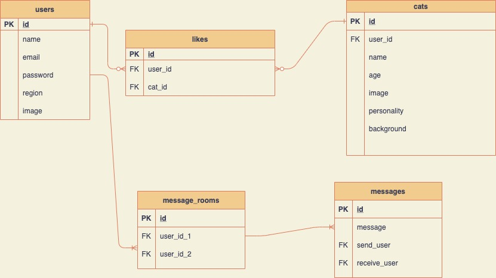
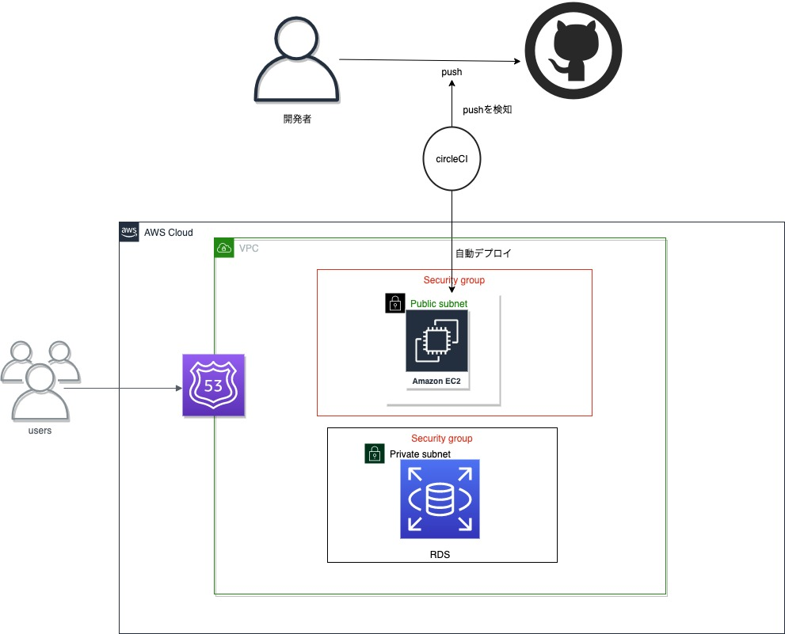

# snuggle

snuggleは猫を買いたい人、今は猫が買えないが猫が好きな人、やむをえない事情により里親を探したい人とを繋げるアプリです。

**[ポートフォリオURL](https://portfolio.snuggle-app.com/)**

## トップページ

<p align="center">

</p>

## 使用技術
* フロントエンド
    * HTML/CSS
    * JavaScript
    * vue.js
    * vuetify(UIフレームワーク)
    * Prettier(コード解析ツール)
    * pusher API

* バックエンド
    * php 7.3.22
    * Laravel 7.30.4

* インフラ
    * MySQL 5.7
    * Nginx
    * AWS(EC2,RDS,Route53,VPC)
    * Circle(CI/CD)

* テスト
    * phpunit

## ER図
<p align="center">

</p>

## AWS構成図

<p align="center">

</p>

## 工夫した点
* フロントエンドにVue.jsを採用してSPAで構築している点。
* AWS、CircleCIの導入。
* シンプルで見やすいUI構成。
* レスポンシブ対応
* チャット機能はpusherを使用しており、リアルタイムで会話することができる。


## 機能一覧
* 新規会員登録
* ログイン・ログアウト機能(ログイン画面からゲストユーザとしてログインできます。)
* 簡単ログイン機能
* ユーザー情報編集機能
* 検索機能
* 猫お気に入り機能
* お気に入り一覧表示
* 猫登録機能
* 猫編集・削除機能
* 画像投稿機能
* リアルタイムチャット機能(pusher,LaravelEcho)

## 環境構築
```
$ git clone git@github.com:ryusei-koja/snuggle-app.git
$ cd snuggle-app
$ docker-compose up -d --build
$ docker-compose exec app bash
$ composer install
$ cp .env.example .env
$ php artisan key:generate
$ php artisan migrate
$ npm install
$ npm run watch
$ exit
```
[http://127.0.0.1:10080](http://127.0.0.1:10080)
